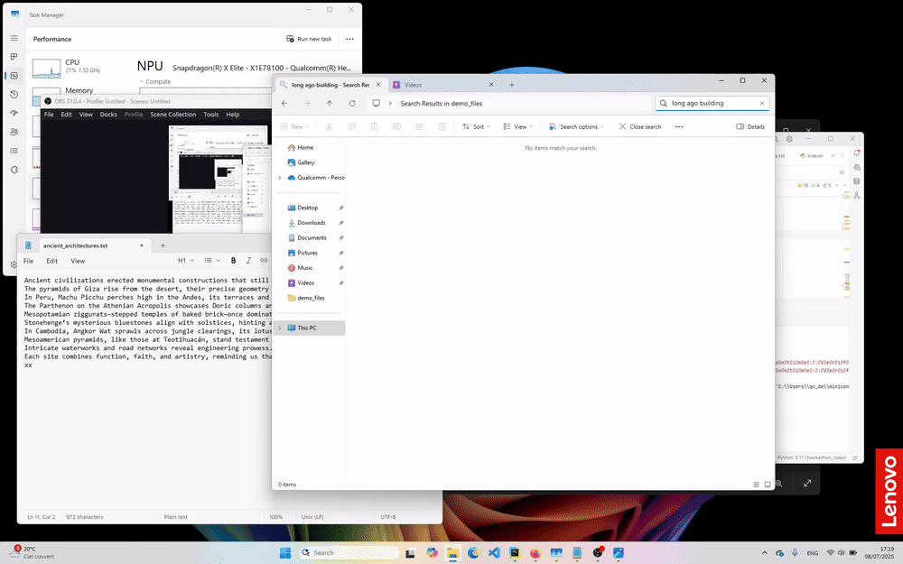
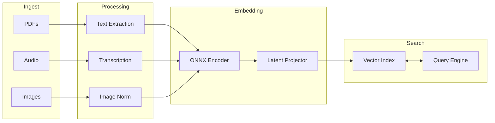

# Mind Search 🧠

[](LICENSE)
[](https://www.python.org/downloads/)
[](https://en.wikipedia.org/wiki/AArch64)
[](https://www.qualcomm.com/products/mobile/snapdragon/pcs)

**Mind Search** is a semantic file search tool that finds your files based on *meaning*, not just filenames. It helps you locate documents, images, and audio recordings using vague recollections and natural language queries.



## Features

- **🔍 Semantic Search**: Find files by describing their content (e.g., "that contract about AI ethics").
- **⚡ NPU Accelerated**: Optimized for Snapdragon X Elite NPUs using ONNX-quantized models.
- **🖼️ Multi-Modal**: Supports PDFs, images, and audio files.
- **🔒 Local & Private**: All processing happens locally on your device.

> [!NOTE]
> **Hackathon Project**: This project was built for the **RAISE Hackathon (Qualcomm Track)** to demonstrate local semantic search optimized for Snapdragon X Elite NPUs.

## Architecture

Mind Search uses a pipeline to process different file types into a shared latent space.



1.  **Ingest**: Load supported file types.
2.  **Processing**: Extract text, transcribe audio, standardize images.
3.  **Embedding**: Generate vectors using NPU-optimized models.
4.  **Search**: Index vectors for fast nearest-neighbor retrieval.

## Installation

1.  **Clone the repository**
    ```bash
    git clone https://github.com/egroh/mind_search.git mind-search
    cd mind-search
    ```

2.  **Install dependencies**
    ```bash
    # Recommended: Use a virtual environment
    python3 -m venv .venv
    source .venv/bin/activate
    
    pip install -r requirements.txt
    ```

## Usage

### 1. Index Your Files

```bash
python mind_search/index.py \
  --data-dir ./my_documents \
  --index-file ./index.pkl \
  --model openai-embedding
```

### 2. Search

```bash
python mind_search/query.py \
  --index-file ./index.pkl \
  --query "that contract I reviewed last month about AI ethics" \
  --top-k 5
```

## Contributors

*   [Eddie Groh](https://github.com/egroh)
*   [Vijay Venkatesh M](https://github.com/vijaysr4)

---

*Made with ❤️ at the RAISE Hackathon*
